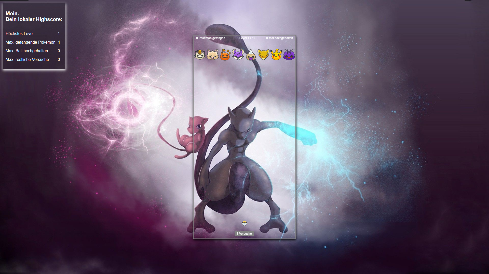

# Catch 'em all

HTML5 Brick Breaker Game with Pokémon theme

This game is an example project to discover HTML5 canvas.
It consists of a local highscore in the top left corner and the main playing area in the middle of the screen.
The player is able to pause the game, reach the final level 10 (hardest level too) or most likely lose all three attempts in the process of achieving the highscore.

## Infrastructure

Made with pure HTML5, CSS3 and native JS. Implemented Firebase as backend technology.

## Future

More features to come.

*Ball speed could increase over time and with difficulty.
*Change user for different local highscores
*Overview of different local highscores
*Global highscores
*Customizable background
*Ingame currency (coins) for playing the game and catching pokemon
*Ingame shop to buy ball / paddle skins and power-ups
*Multilingual
*Random power-ups while playing the game
*Statistics for amount specific pokemon caught
*Statistics for time played overall and per session
*Fullscreen mode
